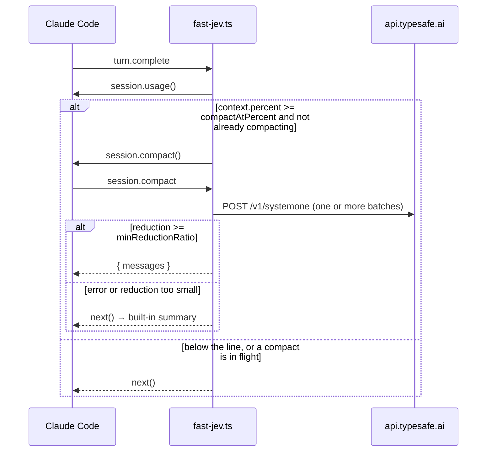

# Claude Code plugin

Operator notes for [`hooks/fast-jev.ts`](fast-jev.ts). The algorithm, the state format, and the library API are in the [repository README](../README.md). This file is only about how the hook sits on top of that library.

The plugin directory is the repository root. `hooks.json` loads `./fast-jev.ts`, and that file imports `../src/` as TypeScript. Claude Code runs the hook; you do not `npm run build` first.

```json
{ "modules": ["./fast-jev.ts"] }
```

## Requirements

Function hooks are early access. This tree vendors the declarations generated by Claude Code **2.1.274** in [`types/claude-code.d.ts`](../types/claude-code.d.ts). Turn the surface on before loading the plugin:

```json
{
  "env": {
    "CLAUDE_CODE_ENABLE_FUNCTION_HOOKS": "1",
    "TYPESAFE_API_KEY": "<your TypeSafe key>"
  }
}
```

That snippet belongs in the Claude Code settings file you actually use (user `~/.claude/settings.json`, or a project `.claude/settings.json`). The key can live there, in the process environment, or in the sensitive `apiKey` plugin option. Prefer the environment for local development. Do not commit the key.

## Install

Marketplace id and plugin id are both `fast-jev-compaction`, from [`.claude-plugin/marketplace.json`](../.claude-plugin/marketplace.json) and [`plugin.json`](../.claude-plugin/plugin.json). The GitHub repository is `jev-compaction-plugin`. Use both names:

```sh
claude plugin marketplace add gabrielegualtieri/jev-compaction-plugin
claude plugin install fast-jev-compaction@fast-jev-compaction
```

If another marketplace already registered the id `fast-jev-compaction`, remove that one before adding this repo. Two marketplaces cannot share the id.

Local load, from the repository root:

```sh
CLAUDE_CODE_ENABLE_FUNCTION_HOOKS=1 claude --plugin-dir .
```

Restart Claude Code after installing. The manifest version is `0.3.0`. That number is not the `0.2.0` in `package.json`, and it is not npm `fast-jev-compaction`.

## Hooks



`session.compact` also runs when compaction starts some other way, including `/compact`. The `turn.complete` hook is only the auto trigger.

Auto-compact details:

- Threshold is `context.percent >= compactAtPercent`. A missing percent is treated as `0`.
- `compacting` blocks a second `session.compact()` until the first call settles.
- Errors from `session.usage()` or `session.compact()` are logged as `auto-compact skipped (<message>)`. They are not toasted. The flag is cleared in `finally`.

## Configuration

Declared in `userConfig`. Anything absent, or not of the declared type, uses the default. The hook then lets the library apply its own defaults for the five numeric options it understands, which match the table.

| Option | Default | Where it is used |
| --- | ---: | --- |
| `apiKey` | unset | Authentication only. Not sent as a model parameter. |
| `model` | `jev-latest` | JSON `model` on every Jev request. |
| `keepThreshold` | `0.5` | `decideCall`. |
| `preserveRecentMessages` | `6` | Pin window, on top of message `0`. |
| `maxStateTokens` | `25000` | `fitState`. |
| `maxRequestTokens` | `30000` | `batchCalls`. |
| `truncateHeadChars` | `300` | `applyDecisions`. |
| `compactAtPercent` | `60` | `turn.complete` only. |
| `minReductionRatio` | `0.25` | Accept or reject the library result. Not sent to Jev. |

`goal` is read if plugin options contain a non-empty string, and forwarded as the state's task description. It is **not** in `plugin.json`, so the install UI will not ask for it.

The hook does not expose `baseUrl` or a custom `fetch`. It always posts to `https://api.typesafe.ai/v1/systemone` through `$.http.fetch`, using `buildJevRequest` / `parseJevResponse` from `src/request.ts`.

### API key order

Applied on every `session.compact`, not cached from the previous turn:

1. `apiKey` plugin option, when it is a non-empty string.
2. `$.env.get("TYPESAFE_API_KEY")`.
3. `$.settings.read().env.TYPESAFE_API_KEY`, when that value is a non-empty string.

If all three miss, `compactSession` throws `TYPESAFE_API_KEY is not configured` and the hook falls back.

## Accept, fall back, report

The library result replaces history only when `reductionRatio >= minReductionRatio`. The ratio is counted characters, not tokens: message text + serialized tool inputs + `tool_result` text. `tool_use.text` is not included. See the root README for why that matters.

| Path | History | Toast (15s) | Decision log |
| --- | --- | --- | --- |
| Reduction large enough | `{ messages }`, no summary | `kept 5/7 messages, no summary (42% reduction; …)` | Yes |
| Reduction under the minimum | `next()`, built-in summary | `fallback to built-in summary (below 25% minimum: …)` | Yes |
| Throw (key, HTTP, malformed answer, state too big, …) | `next()`, built-in summary | `fallback to built-in summary (<error message>)` | No |

`kept 5/7` counts **messages**. Inside the parentheses, `1 kept` counts non-pinned calls whose full result survived. `1 results truncated` and `1 call_dropped` are the other call counts. Zero counts are left out. `N pinned` is included when any call was pinned.

Log lines look like this, and are split so each one stays within 4096 characters:

```text
decisions: t1:Read:drop_call/call=0.10/result=0.10 t2:Bash:keep/call=0.90/result=0.90
decisions (1/2): …
decisions: (none)
```

The third field is the `action` (`keep`, `drop_result`, `drop_call`), then the two probabilities with two decimal places. Pinned calls are omitted.

Returned messages keep the engine object, handle included, when the library did not rebuild them. A truncated result is a new message without a handle. A `drop_result` shorter than or equal to `truncateHeadChars + 120` is not rewritten, so its handle stays.

## After a Claude Code upgrade

Regenerate `types/claude-code.d.ts` with the Claude Code you actually run, then:

```sh
npm run typecheck
npm test
npm run validate:plugin
```

`npm test` never calls TypeSafe. If a hook field was renamed upstream, `tsc -p tsconfig.hooks.json` is what fails.

References:

- [Claude Code plugins](https://code.claude.com/docs/en/plugins)
- [Plugins reference](https://code.claude.com/docs/en/plugins-reference)
- [Hooks](https://code.claude.com/docs/en/hooks)
